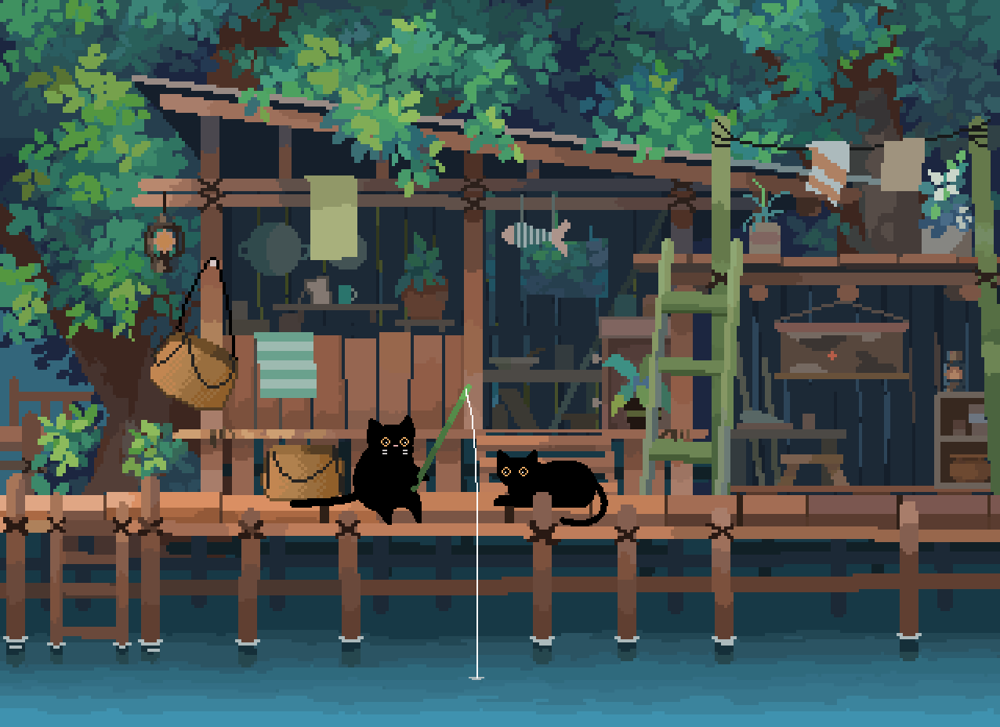
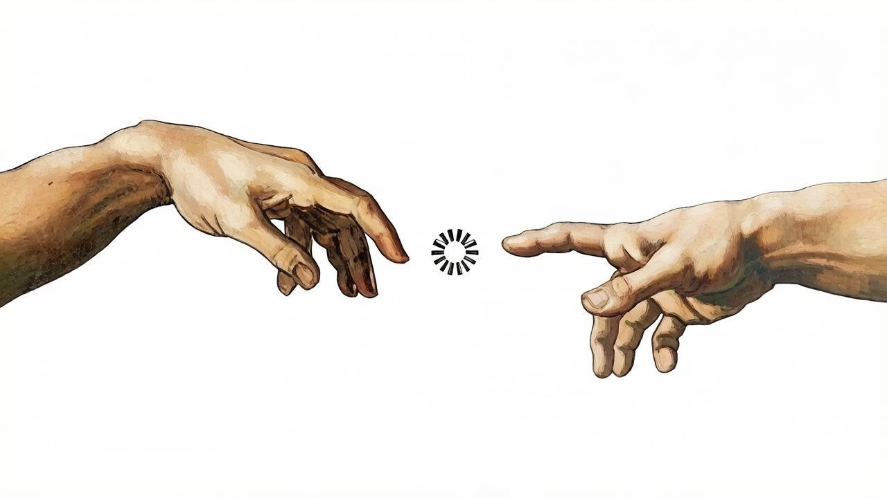

## Hi there, I'm Kirill
<!--
 Это комментарий  -->

## I'm a beginner Software Engineer 
### About me

Hello everyone My name is Kirill, and I’m an aspiring developer. I’m studying at the Faculty of Physics at NSU (Novosibirsk National Research State University) in my third year, at the Department of Semiconductor Physics.

## Languages 

## Frameworks

## Tools

## Follow Me

